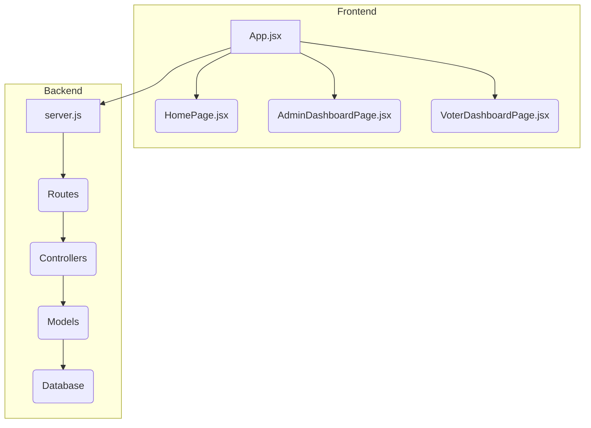
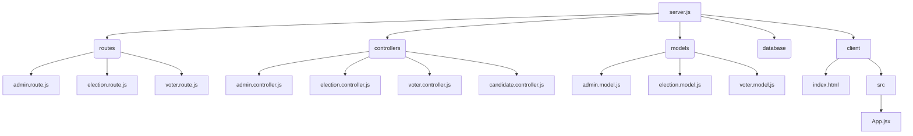

# EVKendra

> A full-stack web application for conducting and managing elections.  This application provides a user-friendly interface for voters and administrators to participate in and oversee the election process.

## 📚 Table of Contents

- [Description](#description)
- [Tech Stack](#tech-stack)
- [Architecture Overview](#architecture-overview)
- [File Structure](#file-structure)
- [Features](#features)
- [Installation](#installation)
  - [Prerequisites](#prerequisites)
  - [Setup](#setup)
- [Usage](#usage)
  - [Execution Options](#execution-options)
- [Contributors](#contributors)
- [License](#license)
- [Credits](#credits)


## Description

EVKendra is a full-stack web application designed to streamline the election process.  It provides a secure and user-friendly platform for voters to cast their ballots and for administrators to manage elections, candidates, and voter registration. The application utilizes a client-side React framework for a dynamic user interface and a Node.js backend with Express.js for handling API requests and database interactions.  The primary use case is to provide a secure and transparent online voting system, offering a unique value proposition of ease of use for both voters and administrators.  Key functions include user authentication, election creation and management, vote casting, and result aggregation.


## Tech Stack

[](https://nodejs.org/)
[](https://expressjs.com/)
[](https://reactjs.org/)
[](https://tailwindcss.com/)
[](https://mongoosejs.com/)
[](https://html.spec.whatwg.org/)
[](https://www.w3.org/Style/CSS/)
[](https://developer.mozilla.org/en-US/docs/Web/JavaScript)
[](https://github.com/PIYUSH1SAINI/ReadMe-wiz.git)


## Architecture Overview



## File Structure



## Features

- Secure user authentication and authorization for voters and administrators.
- Creation and management of elections with customizable parameters.
- User-friendly interface for voters to cast their ballots securely.
- Real-time vote aggregation and result display for administrators.
- Robust backend infrastructure for data management using MongoDB.


## Installation

### Prerequisites

> [!NOTE]
> Node.js >=14 and npm are required for backend and frontend setup.  Ensure you have a MongoDB instance running locally.

### Setup

1. **Clone Repository:** Clone the repository from GitHub and navigate to the project directory.
   ```bash
   git clone https://github.com/raghavG0212/EVKendra.git
   cd EVKendra
   ```

2. **Install Dependencies:** Install the necessary Node.js packages for both the client and server.
   ```bash
   npm install
   npm install --prefix client
   ```


## Usage

### Execution Options

#### Backend Execution

Start the backend server using the following command:

```bash
npm run start
```

> [!IMPORTANT]
> Ensure you have set up the necessary environment variables (database connection string, API keys, etc.) before running the server.


#### Frontend Execution

Start the frontend development server:

```bash
npm run happy_voting
```

This command runs both the frontend and backend concurrently.  Navigate to `http://localhost:5173` in your browser to access the application.


## Contributors

<a href="https://github.com/raghavG0212" target="_blank"></a>


## License

ISC License


## Credits

raghav

Node.js, Express.js, React, Mongoose, MongoDB, HTML5, CSS3, JavaScript


<a href="https://github.com/PIYUSH1SAINI/ReadMe-wiz.git" target="_blank">
      
    </a>
